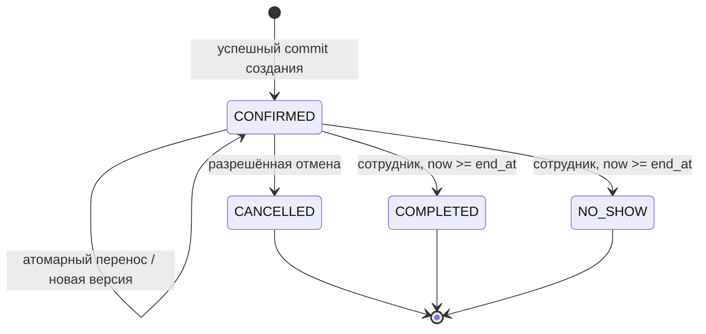

# Предметная область и lifecycle

Это концептуальное описание сущностей, связей и инвариантов. Здесь нет ORM-моделей, SQL DDL, миграций или окончательной схемы таблиц. Физическая схема создаётся позже небольшими PR из [roadmap](../roadmap.md).

## Сущности и ответственность

| Понятие | Смысл и существенные данные | Связи / ограничения |
| --- | --- | --- |
| Business | Один оператор барбершопа | Независимые арендаторы вне MVP |
| Branch | Филиал, адрес, IANA timezone, политика записи | Принадлежит Business; timezone задаётся явно |
| Barber | Конкретный мастер с глобальной идентичностью | Может иметь допуск в нескольких Branch; занятость глобальна |
| ServiceOffering | Услуга филиала: цена, валюта, длительность, буферы | Версия/активность; допуск мастеров; длительность >0 |
| BarberAssignment | Допуск мастера к филиалу и услуге | Уникальность пары/набора; все ссылки одного бизнеса |
| ScheduleRule / ScheduleException | Регулярные локальные смены и датированные исключения/перерывы | Принадлежат мастеру и филиалу; обновление сериализуется с записью |
| Booking | Один согласованный визит | Один Branch, Barber, ServiceOffering; неизменяемый внутренний ID |
| BookingRevision / AuditEntry | Кто и почему изменил запись | Версия, операция, UTC-время, actor, correlation ID; дописываемая история |
| CommandReceipt | Идентичность команды, fingerprint, результат | Уникальность scope + operation + key; атомарен с эффектами |
| IntegrationConnection | Настройки конкретного канала/окружения | Секрет через secret manager; feature flags по возможностям |
| ExternalMapping | Связь локального ID с ID контракта | Уникальность connection + kind + external ID; нет поиска по телефону |
| InboxReceipt | Полученная внешняя команда и результат | Использует механизм CommandReceipt; не вторая независимая истина |
| OutboxEvent | Неизменяемое событие локальной транзакции | ID, booking ID, версия, тип, schema version, минимум данных |
| DeliveryState / SyncCursor | Доставка одному получателю и последнее подтверждение | Retry, lease, ошибка, sent/acknowledged version; не поле lifecycle |
| ReconciliationIssue | Зафиксированное расхождение и решение | Не создаёт визит автоматически; действия аудируются |

В MVP не нужен отдельный клиентский профиль: контакт — минимальный снимок записи. Телефон не является уникальным ID человека и не является ключом идемпотентности. Стратегия хранения/обезличивания контакта описана в [ADR-008](../adr/0008-operations-and-security.md).

## Booking: смысл данных

Содержит внутренний UUID, источник создания (`OWN_WEB`, `STAFF`, `YANDEX`), инициатора, текущую версию, статус, время услуги и занимаемый интервал. Источник создания не меняется при действии сотрудника; actor последней команды хранится отдельно.

Цена хранится точным decimal или целым числом минимальных денежных единиц с валютой, не float. Длительность, буферы, наименование/цена услуги, IANA timezone и применённая политика отмены фиксируются снимком. Изменение цены и расписания не пересчитывает существующую запись. Временной перенос сохраняет снимок услуги/цены; срок отмены вычисляется относительно нового начала с той же политикой.

Время услуги — `[start_at, end_at)`. Занятый интервал — `[start_at - buffer_before, end_at + buffer_after)`. Все границы конечны, non-null; длительность положительна, буферы неотрицательны. Занятый интервал однозначно выводится из авторитетных времён и снимков; физическая схема не должна допускать независимо редактируемый несогласованный range. Весь занятый интервал должен помещаться в смену без перерывов.

Обязательные будущие ограничения БД: существование и согласованность ссылок филиал/услуга/допуск, допустимый enum статуса, версия ≥1, положительная длительность, валидные границы, уникальность receipt/mapping, exclusion для мастера и занятого интервала при статусе, отличном от CANCELLED. Предикат ограничения не зависит от текущего времени. Смена мастера и услуги у созданной записи в MVP запрещена командным API.

## Статусы

| Статус | Значение | Участвует в exclusion / занимает исторический интервал |
| --- | --- | --- |
| CONFIRMED | БД приняла запись; внешний канал мог ещё не получить ответ | Да |
| CANCELLED | Запись отменена разрешённой командой | Нет |
| COMPLETED | Сотрудник отметил оказанную услугу после её окончания | Да |
| NO_SHOW | Сотрудник отметил неявку после окончания планового визита | Да |

Начало и окончание времени сами по себе статус не меняют. Нельзя автоматически считать прошедший визит выполненным. Ошибки создания — ответы команды, а не строки Booking со статусом FAILED. Нет PENDING_SYNC, SYNC_FAILED или YANDEX_CONFIRMED в lifecycle.

## Переходы и повторы

| Команда | Предусловие | Эффект | Повтор / запрет |
| --- | --- | --- | --- |
| CreateBooking | Есть допуск, время допустимо и свободно | CONFIRMED, version=1, audit, outbox | Тот же receipt возвращает исходный ответ |
| CancelBooking | CONFIRMED, до начала, права/срок соблюдены | CANCELLED, version+1, причина, audit, outbox | Уже CANCELLED — успешный no-op, без новой версии/события; другой terminal — конфликт |
| RescheduleBooking | CONFIRMED, до начала, expected_version совпала, новая дата допустима | Новый интервал, version+1, audit, outbox | Занятое время/устаревшая версия оставляют исходный визит; совпадающее время — no-op |
| CompleteBooking | CONFIRMED, now ≥ end_at, сотрудник своего scope | COMPLETED, version+1, audit, outbox | Повтор того же исхода — no-op; другой terminal — конфликт |
| MarkNoShow | CONFIRMED, now ≥ end_at, сотрудник своего scope | NO_SHOW, version+1, audit, outbox | Повтор того же исхода — no-op; другой terminal — конфликт |

Проверка receipt предшествует expected_version, но идёт после проверки доступа. Для новой команды на уже желаемый terminal допускается no-op независимо от старой expected_version после проверки доступа; смена другого состояния требует актуальной версии. Для переноса expected_version обязательна даже при совпадении нового времени. Отмена и завершение с конкурирующими версиями не перезаписывают друг друга.

Терминальные записи не открываются повторно. Исправление ошибочного terminal — будущая отдельная аудируемая операция с ADR; пока сотрудник не получает общий редактор статуса. Повторная запись после отмены создаёт новый booking ID и новый ключ команды. Физическое удаление бронирования не используется для отмены.

## Время и календарь

Транспорт собственного API принимает RFC 3339 с явным offset, выдаёт UTC `Z` плюс timezone филиала. PostgreSQL хранит временные моменты как `timestamptz`: исходное имя зоны этим типом не сохраняется, поэтому IANA ID хранится отдельно. Локальные регулярные смены задаются местным временем и днями недели, исключения — местной датой.

Сначала строится локальное расписание нужной даты, затем однозначно преобразуется в UTC. Несуществующее локальное время при DST отклоняется; неоднозначное требует выбора offset/fold, который должен соответствовать правилам зоны. Для регулярных правил неоднозначная дата должна иметь явное датированное исключение; до этого слоты на неоднозначном участке не публикуются. Смена через полночь имеет явную следующую дату окончания. День считается по филиалу, а не по UTC.

Длительность услуги — прошедшие секунды, не разница показаний часов при DST. Горизонт — локальные календарные дни; lead time и срок отмены — длительности между UTC-моментами. Время проверки берётся из БД после получения блокировок; долгий wait не оставляет устаревшее значение `now`. Плановые изменения timezone/tzdata показывают разницу будущего расписания и проходят тот же контроль конфликтов; сохранённые UTC-моменты не сдвигаются.

Связанные решения: [ADR-002](../adr/0002-postgres-consistency.md), [ADR-005](../adr/0005-booking-lifecycle.md), [ADR-006](../adr/0006-time-and-calendar.md).
