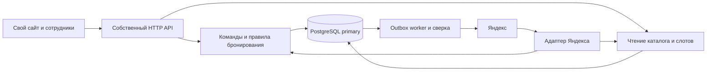

# Архитектура backend

Дата: 2026-09-14. Выполнены PR-01–PR-11, включая каталог, календарь, persistence Booking, audit/outbox, durable receipt, CreateBooking, availability и CancelBooking services. LIFE-01/CON-02 и предыдущие проверки пройдены на PostgreSQL 17; HTTP API отсутствует. См. [требования](../product/requirements.md) и [ADR](../adr/README.md).

## Основной стек

| Область | Решение | Назначение |
| --- | --- | --- |
| Язык | Python 3.13 | Поддерживаемая базовая ветка, синхронный транзакционный код |
| Framework | Django 5.2 LTS + Django REST Framework 3.16 | HTTP API, ORM, миграции, авторизация, служебный интерфейс |
| БД | PostgreSQL 17 + btree_gist, psycopg 3 | Транзакции, range/exclusion constraints, блокировки, outbox/inbox |
| HTTP server | Gunicorn, WSGI; TLS на reverse proxy / платформе | Несколько процессов API без зависимости корректности от памяти процесса |
| Внешний HTTP | HTTPX, синхронный клиент | Ограниченные таймауты и явно контролируемые повторы в worker |
| Фоновые операции | Отдельный процесс из того же образа; PostgreSQL outbox и lease | Доставка событий и периодическая сверка без отдельного брокера на старте |
| Контракт API | OpenAPI, drf-spectacular | Проверяемые схемы собственного API; адаптер Яндекса имеет отдельный контракт |
| Сборка | uv, pyproject.toml, uv.lock, OCI/Docker, Compose для dev/CI | Воспроизводимое окружение |
| Качество | pytest, pytest-django, Hypothesis, Ruff, mypy | Реальная БД для интеграционных тестов, проверка инвариантов и типов |
| Наблюдаемость | Структурированные JSON-логи, Prometheus, OpenTelemetry | Задержки команд/синхронизации, ошибки, корреляция без контактов клиента |

Ветки выбраны осознанно, не как заявление о последних релизах. Точные patch-версии, транзитивные зависимости и digest образов фиксируются на PR-01/02 после проверки совместимости и безопасности. Django 5.2 поддерживает Python 3.13 и PostgreSQL 14+, а ветка PostgreSQL 17 поддерживается до ноября 2029 года. Источники: [Django 5.2](https://docs.djangoproject.com/en/5.2/releases/5.2/), [DRF release notes](https://www.django-rest-framework.org/community/release-notes/), [PostgreSQL version policy](https://www.postgresql.org/support/versioning/).

Redis/Celery пока не нужны: для ожидаемой нагрузки достаточно durable outbox в PostgreSQL. При росте нагрузки брокер можно добавить как транспорт пробуждения; долговечность событий и идемпотентность останутся в БД. Kubernetes, микросервисы и event sourcing не входят в исходный стек.

## Форма системы

Модульный монолит: один репозиторий, одна кодовая база и одна primary БД; API и worker масштабируются отдельными процессами. Состояние бронирования хранится непосредственно, аудит не используется как механизм восстановления агрегата из событий.

Стрелка worker → Яндекс означает отправку проекции состояния после commit. Входящий ответ Яндекса влияет только на журнал доставки; он не подтверждает и не отменяет бронь.

## Границы модулей

| Модуль | Владеет | Ограничение |
| --- | --- | --- |
| identity | Сотрудники, роли, токены управления | Проверяет actor и scope до команды и до replay |
| catalog | Филиалы, услуги, мастера, допуски | Изменения не переписывают снимки визитов |
| scheduling | Локальные смены, исключения, вычисление доступности | Изменения используют тот же lock мастера, что booking |
| booking | Команды создания/отмены/переноса/исхода, версия и история | Единственная точка изменения lifecycle |
| integration | Подключения, внешние ID, inbox/outbox, доставки и сверка | Не меняет booking напрямую; детали Яндекса не проникают в домен |
| operations | Health, метрики, восстановление и диагностика | Не содержит альтернативную бизнес-логику |

Слои: transport → application service → правила предметной области и persistence. Запросы чтения выделены для удобства, но отдельной eventually consistent БД чтения нет. Django Admin для записей — чтение и явные actions через application service; общий редактор полей отключён.

## Consistency и границы транзакции

Авторитетные чтения booking/availability идут на primary. Слот — предложение, не reservation. Окончательное решение принимает create/reschedule внутри короткой `transaction.atomic()` при READ COMMITTED с блокировкой строки мастера и DB exclusion constraint. READ COMMITTED без этих мер недостаточен. Разбор блокировок — в [booking-flow](booking-flow.md).

Одна успешная команда фиксирует booking, версию, аудит, идемпотентный ответ, необходимые mapping и outbox в одной БД. Внутри транзакции нет сети, отправки email, sleep и ожидания брокера. `on_commit` может разбудить worker, но не заменяет сохранение outbox: процесс может погибнуть сразу после commit. Основание: [Django transactions](https://docs.djangoproject.com/en/5.2/topics/db/transactions/).

Синхронизация внешних представлений eventually consistent. Повторная доставка допустима; end-to-end exactly-once не заявляется. Ошибки доставки видны сотруднику отдельно от доменного статуса. Кэш доступности можно добавить позже; TTL не даёт права обходить финальную проверку БД.

## Эксплуатация

Начальная поставка: контейнер API, контейнер worker, PostgreSQL с резервным копированием и PITR; тестовая и production среды изолированы. Приложение работает без DDL-прав; отдельная роль выполняет миграции и установку btree_gist. Миграции не запускаются конкурентно каждым API-процессом.

Liveness подтверждает жизнеспособность процесса; readiness — доступность primary и ожидаемую версию схемы. Недоступность Яндекса не снимает readiness собственного API. Ограничены пул соединений, размер тела запроса, диапазон выдачи слотов, длительность транзакций и число повторов. Graceful shutdown прекращает приём новых команд; незавершённые транзакции откатываются, незавершённые lease восстанавливаются.

Доставка: сначала расширение схемы, затем совместимое приложение, затем backfill при необходимости; удаление старой структуры — отдельный PR. Отказ от релиза означает откат образа, а не автоматический destructive downgrade БД. Восстановление из backup обязательно проверяется вместе с inbox/outbox: внешний канал мог увидеть события, которых уже нет после PITR. PR-02 закрепляет dev/CI PostgreSQL 17 и `btree_gist`; будущий production-провайдер ещё не выбран, поэтому возможность установки расширения остаётся обязательной зависимостью выбора хостинга. См. [тестирование](../testing-strategy.md) и [ADR-008](../adr/0008-operations-and-security.md).
